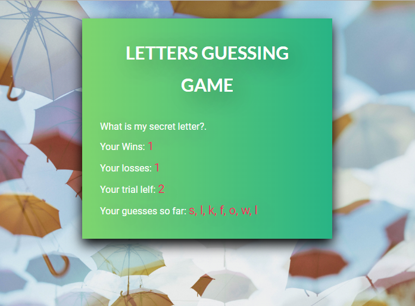

# Letters Guessing - Psychic Game
JavaScript Assignment - Create a Letters Guessing - Psychic Game.

The goal of this assignment is to create a game that will randomly store a secret letter in memory, the game will give the user 9 trials to guess for a matching letter.

The game must keep track of the user's entered letters, print the letters on the html page, and update the wins and losses score. The game must reset the to initial stage when the user won a point or runout of trials without winning a point. 

## Run The App
[Click here to run](https://monksedo.github.io/PsychicGame/)

## Game Features
1. The game will randomly pick a hidden letter, and the user has to guess the letter to match hidden letter from memory.
2. The game will start with asking the user to pick a letter.
3. The User has 9 trials to guess for the winning letter.
4. The game will compare the letters and update the wins score, and losses score.
5. The game will restart when the user won a point or run out of turns

## Technology Used
HTML, CSS, JAVASCRIPT

## Project Images
